# car-reservation
A PHP web site - student project (a week of work in december 2022).

Front and back office pages in order to manage car reservations.

&nbsp;

---

## Prerequisites
- A web server
- PHP
- MySQL

### Stack used on this project
- XAMPP v3.3.0
- Apache v2.4.54
- PHP v8.1.10
- MariaDB v10.4.25

&nbsp;

### DB design used on this project
***"Location DB"***

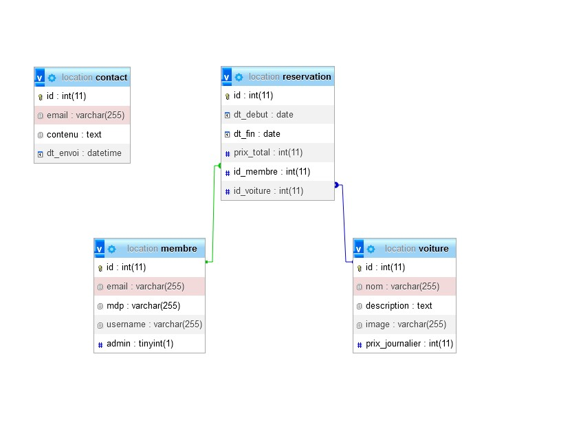

---

### Next steps (maybe)

- finish CRUD (Delete and Update a reservation by an administrator or client)

- fix the reservation price calculator (total price for a reservation period) - DONE
- add more CSS Style
- add more interractivity

&nbsp;

- Add more SECURITY

**Important** : The PHP script to encrypt data was not pushed yet.

&nbsp;

--- 

## Screenshots

### Home page
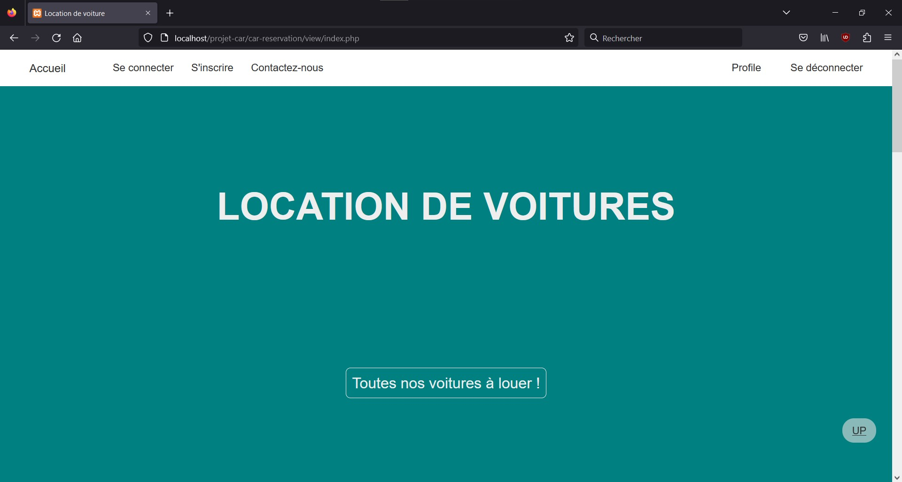

&nbsp;

### Home - cars list

&nbsp;

### Subscription page
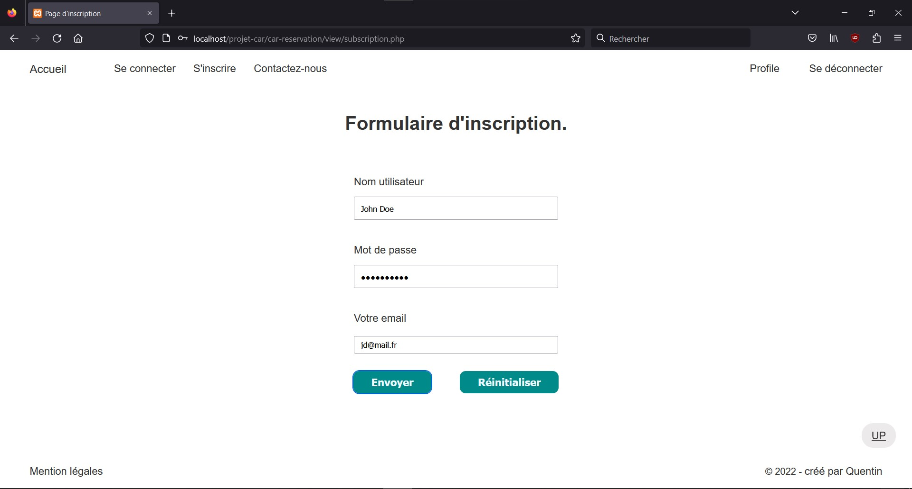

&nbsp;

### Login page
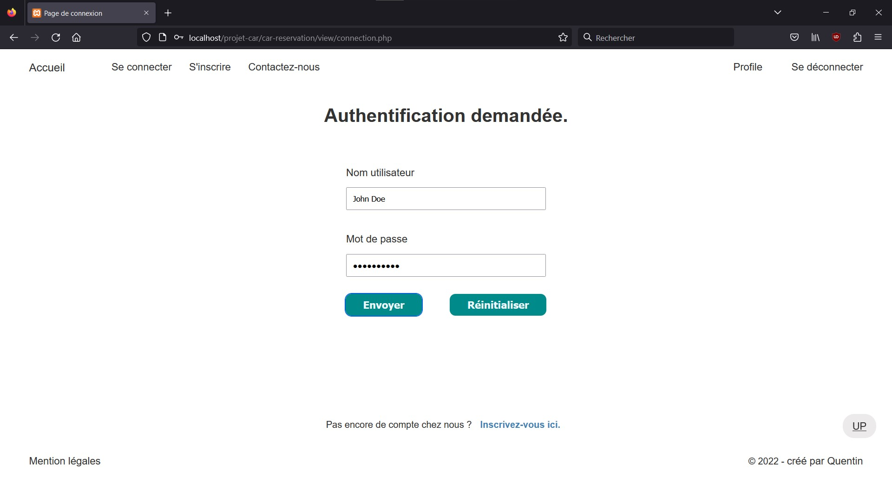

&nbsp;

### User profile page
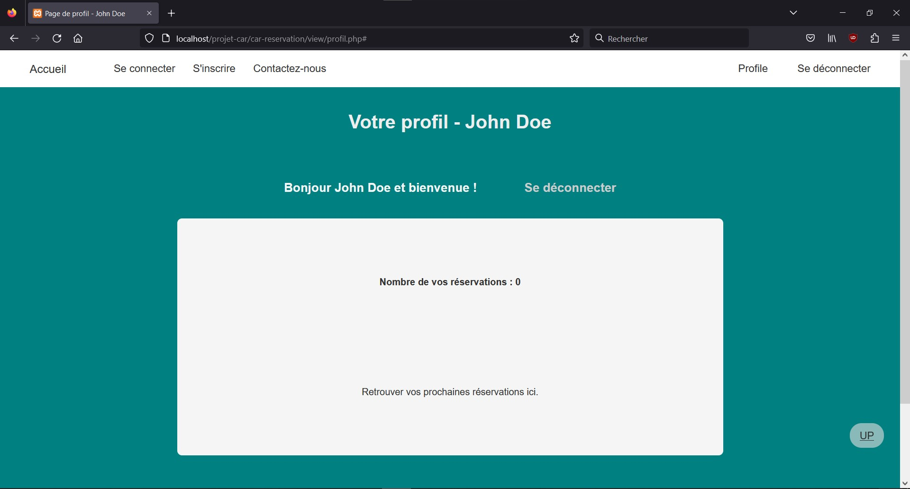

&nbsp;

### Rent a car
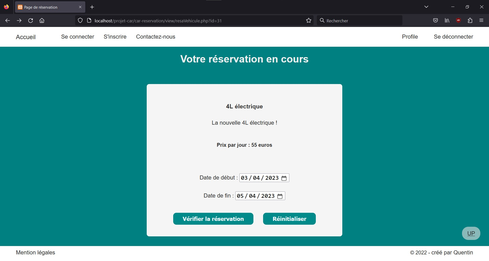

&nbsp;

### Verify informations about the rent
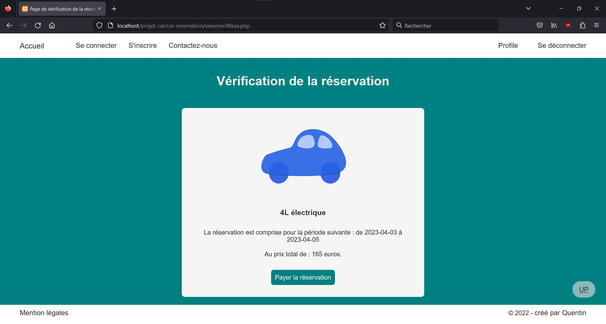

&nbsp;

### Reservation OK
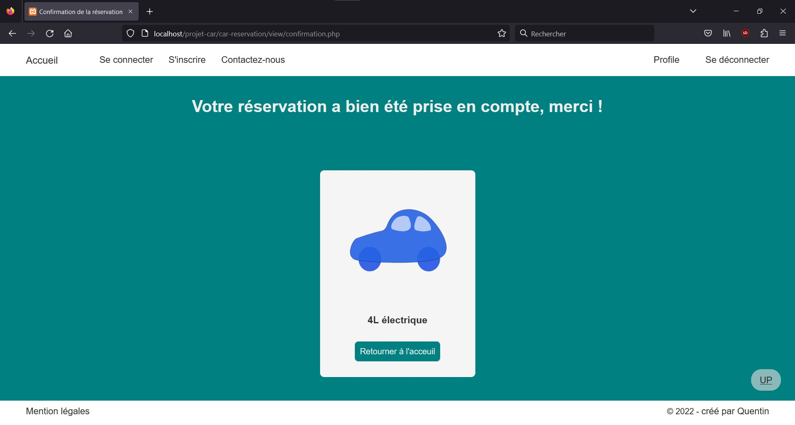

&nbsp;

### Admin dashboard - login page
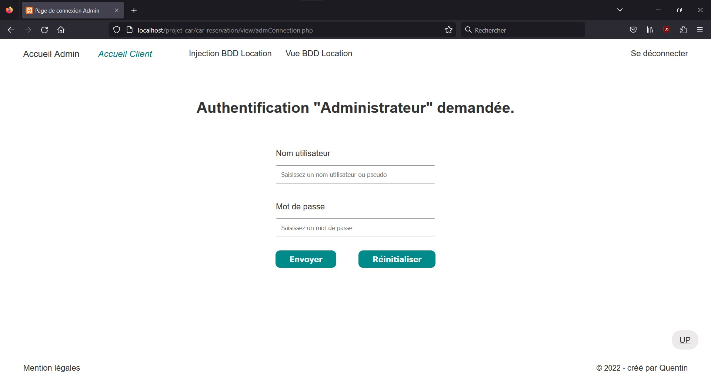

&nbsp;

### Admin dashboard - home page
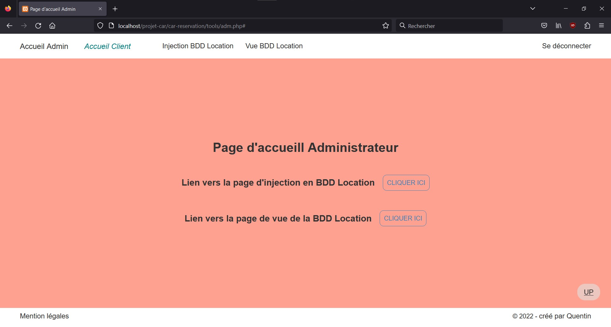

&nbsp;

### Admin dashboard - BDD create page
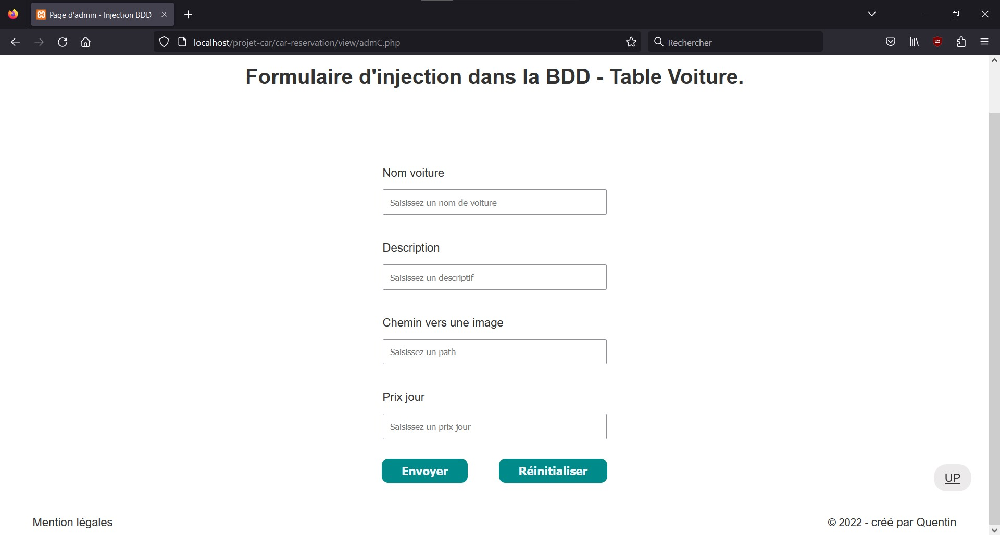

&nbsp;

### Admin dashboard - BDD read page
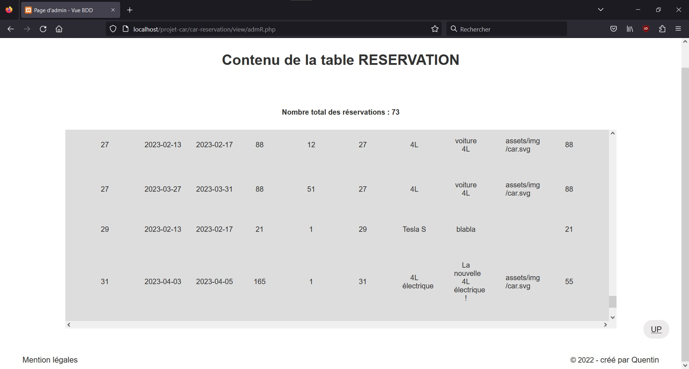

&nbsp;

